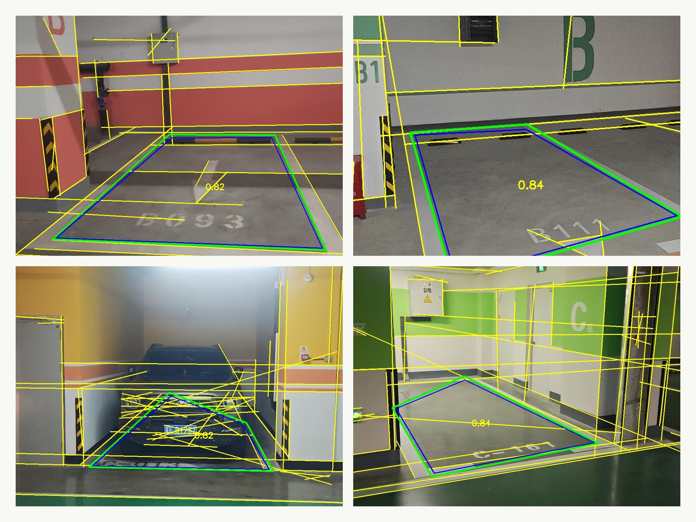
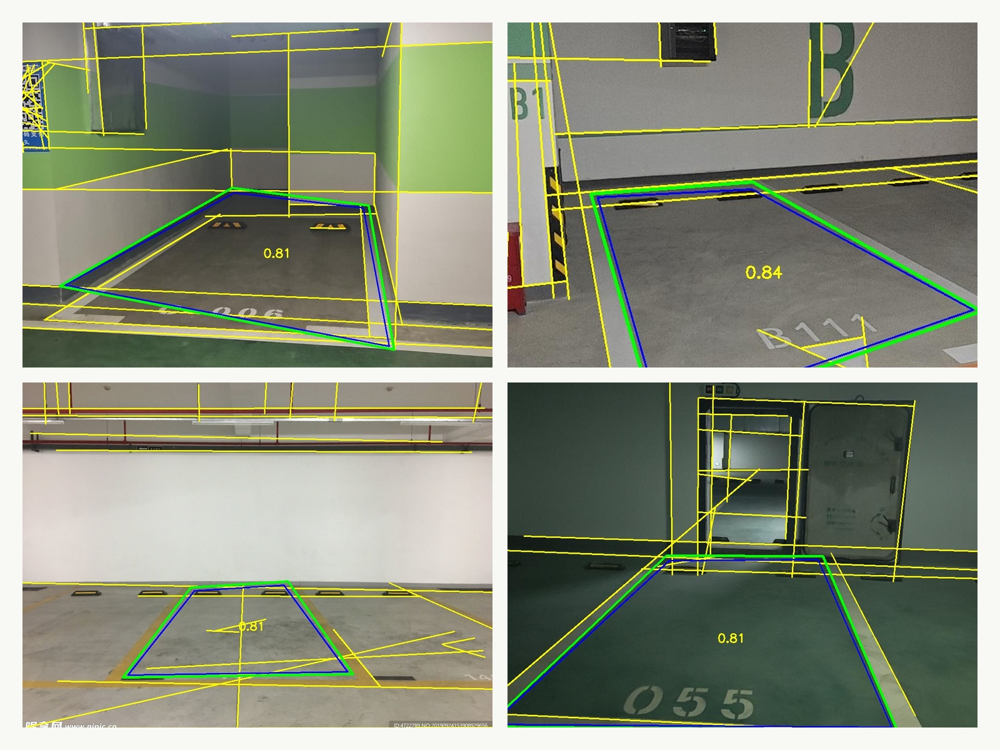
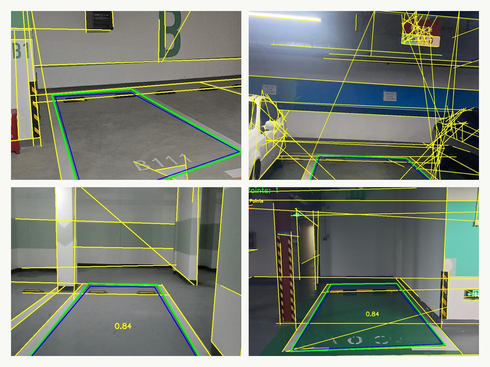

# FST Classifier Tool

面向停车位场景的本地化识别、标注与推理工具。仓库当前聚焦三个方向：

- 停车位/地面标线/模板的检测与验证
- FST 结构化标注与结果导出
- Web 纠正界面与批量脚本化测试

这个版本的仓库保留源码、文档、配置和 README 展示素材；`dataset/`、`checkpoints/`、`models/`、`output/`、`test_results*/` 等运行期数据默认不纳入版本控制。

## 核心能力

- 统一 CLI 入口：通过 `cli.py` 统一调用标注、训练、导出、推理和 Web UI
- 本地推理链路：支持基于模型与规则的停车位场景分析
- 在线纠正：通过 Gradio 页面上传图片、修正结果并回流为数据集样本
- 脚本化验证：提供模板检测、DMPR 测试、可视化与评估脚本
- 文档分层：架构、迁移、标注、模型测试等说明已整理到 `docs/`

## 效果展示







## 快速开始

### 1. 安装依赖

```bash
python -m venv .venv
.venv\Scripts\activate
pip install -e .
pip install -r requirements.txt
```

### 2. 常用命令

```bash
# 查看帮助
python cli.py --help

# 半自动标注
python cli.py label --auto

# 训练
python cli.py train --batch 32 --epochs1 10 --epochs2 30

# 单张推理
python cli.py infer --image path/to/image.jpg --visualize

# 批量推理
python cli.py infer --images path/to/images --visualize

# 启动 Web 界面
python cli.py app
```

## 仓库结构

```text
fst_classifier_tool/
├── cli.py
├── fst/                 # 核心应用代码
├── configs/             # 配置文件
├── docs/                # 项目文档
├── examples/            # 推理示例
├── schema/              # Schema 定义
├── scripts/             # 开发/评估/可视化脚本
├── tests/               # 回归与实验脚本
├── resources/           # 静态资源和样例
└── docs/readme_assets/  # README 展示图片
```

## 文档索引

- [项目结构说明](docs/PROJECT_STRUCTURE.md)
- [自动标注指南](docs/AUTO_LABEL_GUIDE.md)
- [模型测试说明](docs/README_MODEL_TEST.md)
- [架构说明](docs/ARCHITECTURE.md)
- [迁移说明](docs/MIGRATION_GUIDE.md)

## 版本控制约定

- 保留到仓库：源码、脚本、配置、文档、README 展示素材
- 不提交到仓库：数据集原图、模型权重、推理输出、测试结果目录
- README 展示图位于 `docs/readme_assets/`，是唯一允许跟踪的图片资源目录
